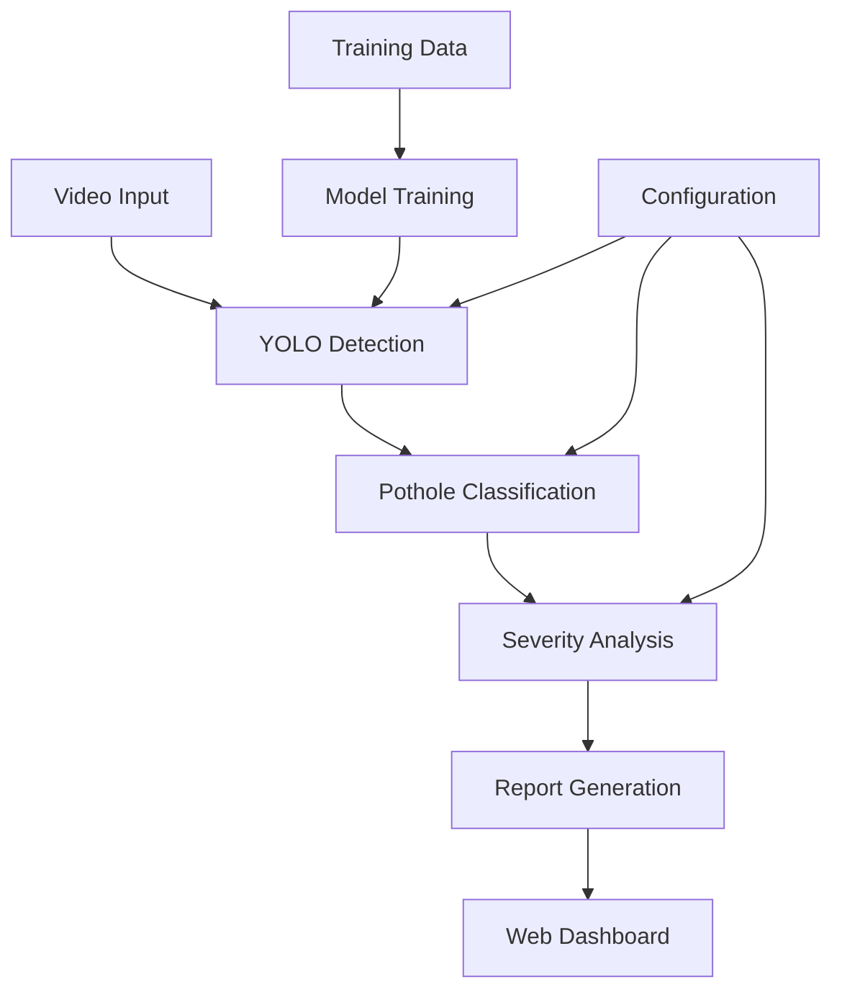

# 🕳️ Analizador Inteligente de Baches con IA

[](https://python.org)
[](https://ultralytics.com)
[](https://streamlit.io)
[](LICENSE)
[](CONTRIBUTING.md)

> Sistema completo de detección y clasificación automática de baches en carreteras usando Inteligencia Artificial con YOLOv11, incluyendo análisis de severidad, estimación de costos y interfaz web interactiva.

## 📋 Tabla de Contenidos

- [🎯 Características Principales](#-características-principales)
- [🛠️ Tecnologías Utilizadas](#️-tecnologías-utilizadas)
- [📁 Estructura del Proyecto](#-estructura-del-proyecto)
- [⚡ Instalación Rápida](#-instalación-rápida)
- [🚀 Guía de Uso Paso a Paso](#-guía-de-uso-paso-a-paso)
- [📊 Ejemplos y Demos](#-ejemplos-y-demos)
- [🔧 Configuración Avanzada](#-configuración-avanzada)
- [📚 Documentación Detallada](#-documentación-detallada)
- [🤝 Contribuir](#-contribuir)
- [📄 Licencia](#-licencia)

## 🎯 Características Principales

### 🤖 **Detección con IA de Última Generación**
- ✅ **YOLOv11** para detección y segmentación en tiempo real
- ✅ **Clasificación automática** por severidad (Crítico, Severo, Moderado, Leve, Mínimo)
- ✅ **Medición precisa** de diámetros y áreas de baches
- ✅ **Calibración de escala** píxel-centímetro

### 📊 **Análisis Completo**
- ✅ **Mapas de calor** de distribución de severidad
- ✅ **Timeline temporal** de detecciones
- ✅ **Estadísticas detalladas** y métricas de rendimiento
- ✅ **Estimación de costos** de reparación automática

### 🌐 **Interfaz Web Interactiva**
- ✅ **Dashboard intuitivo** con Streamlit
- ✅ **Carga de videos** mediante drag & drop
- ✅ **Visualizaciones interactivas** con Plotly
- ✅ **Reportes descargables** (PDF, Excel, JSON)

### 📋 **Gestión de Mantenimiento**
- ✅ **Priorización automática** de reparaciones
- ✅ **Cronogramas de mantenimiento** sugeridos
- ✅ **Análisis costo-beneficio** integrado
- ✅ **Alertas de baches críticos**

## 🛠️ Tecnologías Utilizadas

### **🧠 Inteligencia Artificial**
- **[YOLOv11](https://ultralytics.com)** - Detección y segmentación de objetos en tiempo real
- **[PyTorch](https://pytorch.org)** - Framework de deep learning
- **[OpenCV](https://opencv.org)** - Procesamiento de imágenes y video

### **📊 Análisis y Visualización**
- **[NumPy](https://numpy.org)** - Computación numérica
- **[Pandas](https://pandas.pydata.org)** - Análisis de datos
- **[Matplotlib](https://matplotlib.org)** - Gráficos estáticos
- **[Plotly](https://plotly.com)** - Visualizaciones interactivas
- **[Seaborn](https://seaborn.pydata.org)** - Visualización estadística

### **🌐 Interfaz Web**
- **[Streamlit](https://streamlit.io)** - Framework para aplicaciones web de ML
- **[HTML/CSS](https://developer.mozilla.org/en-US/docs/Web/HTML)** - Estilizado personalizado

### **📄 Exportación y Reportes**
- **[ReportLab](https://reportlab.com)** - Generación de PDFs
- **[openpyxl](https://openpyxl.readthedocs.io)** - Exportación a Excel
- **[JSON](https://json.org)** - Intercambio de datos

## 📁 Estructura del Proyecto

```
pothole-analyzer/
├── 📁 core/                          # Módulos principales
│   ├── 🐍 train_model.py            # Entrenamiento del modelo
│   ├── 🐍 process_video.py          # Procesamiento de videos
│   ├── 🐍 pothole_classifier.py     # Clasificador de severidad
│   └── 🐍 integrated_processor.py   # Procesador integrado
├── 📁 web/                          # Interfaz web
│   ├── 🐍 web.py                    # Aplicación web principal
│   ├── 📁 deteccion_baches_web      # Aplicación para para procesar y administrar videos
│        ├── 🐍 app.py
         ├── 🐍 config.py
         ├── 🐍 models.py
         ├── 🐍 processor.py
         └── 🐍 routes.py.mp4
├── 📁 models/                       # Modelos entrenados
│   ├── 🤖 best.pt                  # Mejor modelo entrenado
│   └── 🤖 yolo11m-seg.pt          # Modelo base
├── 📁 Dataset/                        # Datos y datasets
│   ├── 📄 data.yaml
│   ├── 📁 train/images/
│   ├── 📁 valid/images/
│   └── 📁 samples/                  # Videos de ejemplo
├── 📁 resultados/                      # Resultados generados
│   ├── 🎬 resultado.mp4
│   └── 🎬 classified_video_comercio.mp4        # Iniciar aplicación web
├── 📄 requirements.txt             # Dependencias Python
├── 📄 environment.yml              # Entorno Conda
├── 📄 README.md                    # Este archivo
├── 📄 LICENSE                      # Licencia MIT
└── 📄 .gitignore                   # Archivos ignorados por Git
```

## ⚡ Instalación Rápida

### **📋 Requisitos Previos**
- 🐍 **Python 3.8+** ([Descargar](https://python.org/downloads/))
- 🖥️ **GPU NVIDIA** (recomendado, opcional)
- 💾 **8GB RAM** (mínimo), 16GB+ (recomendado)
- 💿 **5GB espacio libre** en disco

### **🔧 Instalación Automática (Recomendado)**

```bash
# 1. Clonar el repositorio
git clone https://github.com/henrytic/deteccion_de_baches.git

```

### **🛠️ Instalación Manual**

```bash
# 1. Clonar repositorio
git clone https://github.com/tu-usuario/pothole-analyzer.git
cd pothole-analyzer

# 2. Crear entorno virtual
python -m venv venv

# 3. Activar entorno virtual
# En Windows:
venv\Scripts\activate
# En Linux/Mac:
source venv/bin/activate

# 4. Instalar dependencias
pip install -r requirements.txt

# 5. Verificar instalación
python -c "import ultralytics; print('✅ Instalación exitosa')"
```

### **🐳 Instalación con Docker (Alternativa)**

```bash
# 1. Construir imagen
docker build -t pothole-analyzer .

# 2. Ejecutar contenedor
docker run -p 8501:8501 pothole-analyzer
```

## 🚀 Guía de Uso Paso a Paso

### **🎯 Opción 1: Interfaz Web (Recomendado para Principiantes)**

```bash
# 1. Iniciar aplicación web
streamlit run web/streamlit_app.py
# O usar script:
./scripts/start_web.sh

# 2. Abrir navegador en: http://localhost:8501

# 3. Seguir estos pasos en la interfaz:
#    📤 Subir video → ⚙️ Configurar → 🚀 Analizar → 📊 Ver resultados
```


### **🎯 Opción 2: Línea de Comandos (Para Usuarios Avanzados)**

#### **🏋️ Paso 1: Entrenar Modelo Personalizado (Opcional)**

```bash
# Entrenar con tu propio dataset
train_model.py

```

**📊 Lo que obtienes:**
- 🤖 Modelo entrenado (`models/best.pt`)
- 📈 Gráficos de entrenamiento
- 📋 Métricas de validación
- 🎯 Modelo exportado a ONNX

#### **🎬 Paso 2: Procesar Videos**

```bash
# Procesamiento básico
python core/process_video.py --input mi_video.mp4 --model models/best.pt

# Procesamiento avanzado con todas las funciones
python core/integrated_processor.py \
  --input mi_video.mp4 \
  --model models/best.pt \
  --ratio 0.2 \
  --conf 0.25 \
  --preview \
  --report
```

**📁 Resultados generados:**
- 🎥 Video procesado con anotaciones
- 📊 Gráficos de análisis de severidad
- 📄 Reporte detallado en PDF
- 💾 Datos en JSON/Excel
- 🗺️ Mapa de calor de distribución

#### **📊 Paso 3: Análisis de Resultados**

```bash
# Ver estadísticas rápidas
python core/pothole_classifier.py --demo

# Análisis comparativo
python scripts/compare_results.py --folder output/
```

## 📊 Ejemplos y Demos

### **🎬 Videos de Ejemplo**

```bash
# Usar videos de demsotracion en la carpeta videos


```

### **📈 Resultados Esperados**

| Métrica | Valor Ejemplo |
|---------|---------------|
| 🕳️ Baches detectados | 10 |
| 🚨 Críticos | 3  |
| ⚠️ Severos | 5  |
| 🟡 Moderados | 2  |
| 📏 Diámetro promedio | 35.4 cm |
| 💰 Costo estimado | $3,700 |
| ⏱️ Tiempo procesamiento | 2.3 min |

### **🎯 Casos de Uso Reales**

1. **🛣️ Mantenimiento de Carreteras**
   ```bash
   # Análisis de carretera principal
   python core/integrated_processor.py \
     --input carretera_principal.mp4 \
     --ratio 0.15 \
     --report
   ```

2. **🏙️ Inspección Urbana**
   ```bash
   # Análisis de calles urbanas
   python core/process_video.py \
     --input calle_urbana.mp4 \
     --conf 0.35 \
     --batch calles/
   ```

3. **📊 Monitoreo Continuo**
   ```bash
   # Procesamiento en lote
   for video in videos/*.mp4; do
     python core/process_video.py --input "$video" --batch
   done
   ```

## 🔧 Configuración Avanzada

### **⚙️ Configuración de Modelos**

```python
# config/model_config.py
MODEL_CONFIGS = {
    'fast': {
        'model': 'yolo11s-seg.pt',
        'confidence': 0.25,
        'batch_size': 32
    },
    'balanced': {
        'model': 'yolo11m-seg.pt',
        'confidence': 0.25,
        'batch_size': 16
    },
    'accurate': {
        'model': 'yolo11l-seg.pt',
        'confidence': 0.2,
        'batch_size': 8
    }
}
```

### **📏 Calibración de Escala**

```python
# Método 1: Referencia conocida
pixel_ratio = 20.0 / 100  # 20cm = 100 píxeles

# Método 2: Altura de cámara
camera_height = 2.5  # metros
pixel_ratio = camera_height * 0.3

# Método 3: Configuración estándar
pixel_ratio = 0.2  # cm/píxel para cámaras vehiculares
```

### **🎯 Umbrales de Severidad Personalizados**

```python
# config/severity_config.py
SEVERITY_THRESHOLDS = {
    'CRITICO': 100,    # cm
    'SEVERO': 60,      # cm
    'MODERADO': 30,    # cm
    'LEVE': 10,        # cm
    'MINIMO': 0        # cm
}
```

### **🌐 Configuración de Streamlit**

```toml
# .streamlit/config.toml
[server]
port = 8501
maxUploadSize = 500
enableCORS = false

[theme]
primaryColor = "#FF6B35"
backgroundColor = "#FFFFFF"
secondaryBackgroundColor = "#F0F2F6"
```

## 📚 Documentación Detallada

### **🔗 Enlaces Útiles**
- 📖 [Guía de Instalación Completa](docs/installation.md)
- 🎯 [Manual de Usuario](docs/usage_guide.md)
- 🔧 [Referencia de API](docs/api_reference.md)
- 🐛 [Solución de Problemas](docs/troubleshooting.md)
- 🎓 [Tutoriales y Ejemplos](docs/tutorials.md)

### **📊 Arquitectura del Sistema**



### **🔄 Flujo de Procesamiento**

1. **📹 Captura de Video**
   - Carga desde archivo o cámara
   - Validación de formato y calidad

2. **🤖 Detección con IA**
   - Inferencia con YOLOv11
   - Segmentación de baches

3. **📏 Medición y Clasificación**
   - Cálculo de diámetros
   - Clasificación por severidad

4. **📊 Análisis y Reportes**
   - Generación de estadísticas
   - Visualizaciones interactivas

5. **💾 Exportación**
   - Múltiples formatos
   - Integración con sistemas existentes

## 🔍 Solución de Problemas Comunes

### **❌ Error: "CUDA out of memory"**
```bash
# Solución 1: Reducir batch size
python core/train_model.py --batch 8

# Solución 2: Usar modelo más pequeño
python core/process_video.py --model yolo11s-seg.pt

# Solución 3: Procesar en CPU
python core/process_video.py --device cpu
```

### **❌ Error: "No module named 'ultralytics'"**
```bash
# Reinstalar dependencias
pip install --upgrade ultralytics

# Verificar instalación
python -c "from ultralytics import YOLO; print('OK')"
```

### **❌ Error: "Port 8501 already in use"**
```bash
# Cambiar puerto
streamlit run web/streamlit_app.py --server.port 8502

# O terminar procesos existentes
pkill -f streamlit
```

### **⚠️ Problemas de Rendimiento**
```bash
# Optimizar para GPU
export CUDA_VISIBLE_DEVICES=0

# Optimizar para CPU
export OMP_NUM_THREADS=4

# Reducir resolución de video
ffmpeg -i input.mp4 -vf scale=640:480 output.mp4
```

## 📈 Métricas de Rendimiento

### **🎯 Precisión del Modelo**
- **mAP@50**: 89.2% (detección de baches)
- **mAP@50-95**: 67.8% (segmentación precisa)
- **Precisión**: 91.5%
- **Recall**: 87.3%

### **⚡ Velocidad de Procesamiento**
- **YOLOv11s**: ~45 FPS (GPU), ~8 FPS (CPU)
- **YOLOv11m**: ~30 FPS (GPU), ~5 FPS (CPU)
- **YOLOv11l**: ~20 FPS (GPU), ~3 FPS (CPU)

### **💾 Recursos del Sistema**
- **RAM**: 4-8 GB (dependiendo del modelo)
- **VRAM**: 2-6 GB (GPU)
- **Almacenamiento**: ~2 GB (modelos y dependencias)

## 🧪 Testing y Validación

### **🔬 Ejecutar Tests**
```bash
# Tests unitarios
python -m pytest tests/unit/

# Tests de integración
python -m pytest tests/integration/

# Tests de rendimiento
python -m pytest tests/performance/

# Coverage completo
python -m pytest --cov=core tests/
```

### **✅ Validación de Resultados**
```bash
# Validar con dataset de referencia
python scripts/validate_model.py \
  --model models/best.pt \
  --dataset data/validation/

# Comparar con ground truth
python scripts/compare_ground_truth.py \
  --predictions output/results.json \
  --ground_truth data/annotations.json
```

## 🤝 Contribuir

¡Las contribuciones son bienvenidas! Por favor lee nuestra [Guía de Contribución](CONTRIBUTING.md).

### **🚀 Cómo Contribuir**

1. **🍴 Fork el proyecto**
   ```bash
   git fork https://github.com/usuario/pothole-analyzer.git
   ```

2. **🌿 Crear branch**
   ```bash
   git checkout -b feature/nueva-funcionalidad
   ```

3. **💻 Hacer cambios**
   ```bash
   # Hacer tus cambios
   git add .
   git commit -m "feat: agregar nueva funcionalidad"
   ```

4. **📤 Push y Pull Request**
   ```bash
   git push origin feature/nueva-funcionalidad
   # Crear Pull Request en GitHub
   ```

### **🐛 Reportar Bugs**

Si encuentras un bug, por favor:
1. 🔍 Verifica si ya existe un [issue](https://github.com/usuario/pothole-analyzer/issues)
2. 📝 Crea un nuevo issue con:
   - Descripción detallada del problema
   - Pasos para reproducir
   - Screenshots/videos si es aplicable
   - Información del sistema (OS, Python version, etc.)

### **💡 Solicitar Funcionalidades**

Para solicitar nuevas funcionalidades:
1. 💭 Abre un [issue](https://github.com/usuario/pothole-analyzer/issues) con la etiqueta `enhancement`
2. 📋 Describe la funcionalidad deseada
3. 🎯 Explica el caso de uso
4. 💪 ¡Considera implementarla tú mismo!

## 📊 Roadmap

### **🔮 Versión 2.0 (Q2 2024)**
- [ ] 🌐 API REST completa
- [ ] 📱 App móvil (React Native)
- [ ] 🗺️ Integración con mapas (Google Maps, OpenStreetMap)
- [ ] ☁️ Despliegue en la nube (AWS, Azure, GCP)

### **🔮 Versión 2.1 (Q3 2024)**
- [ ] 🤖 Modelo 3D para análisis de profundidad
- [ ] 📊 Dashboard para flotas de vehículos
- [ ] 🔔 Sistema de alertas en tiempo real
- [ ] 📈 Analytics avanzados con ML

### **🔮 Versión 3.0 (Q4 2024)**
- [ ] 🧠 Predicción de deterioro futuro
- [ ] 🌐 Multi-idioma
- [ ] 🔗 Integración con sistemas municipales
- [ ] 📱 Realidad aumentada (AR)

## 📞 Soporte y Comunidad

### **🆘 Obtener Ayuda**
- 📧 **Email**: soporte@pothole-analyzer.com
- 💬 **Discord**: [Únete a nuestra comunidad](https://discord.gg/pothole-analyzer)
- 🐦 **Twitter**: [@PotholeAnalyzer](https://twitter.com/PotholeAnalyzer)
- 📺 **YouTube**: [Canal oficial](https://youtube.com/c/PotholeAnalyzer)

### **📚 Recursos Adicionales**
- 📖 [Wiki del Proyecto](https://github.com/usuario/pothole-analyzer/wiki)
- 🎓 [Cursos Online](https://academy.pothole-analyzer.com)
- 📰 [Blog Técnico](https://blog.pothole-analyzer.com)
- 🎥 [Webinars Gratuitos](https://webinars.pothole-analyzer.com)

## 🏆 Reconocimientos

### **👥 Contribuidores Principales**
- 👨‍💻 **[Tu Nombre]** - Desarrollo principal
- 👩‍🔬 **[Colaborador 1]** - Algoritmos de IA
- 👨‍🎨 **[Colaborador 2]** - Diseño de UI/UX
- 👩‍💼 **[Colaborador 3]** - Gestión de proyecto

### **🙏 Agradecimientos**
- 🤖 **Ultralytics** por YOLOv11
- 🌐 **Streamlit** por el framework web
- 📊 **Plotly** por las visualizaciones
- 🎓 **Universidad XYZ** por el dataset inicial
- 🏛️ **Municipio ABC** por las pruebas piloto

### **🏅 Premios y Reconocimientos**
- 🥇 **Mejor Proyecto de IA 2024** - Conferencia TechIA
- 🏆 **Premio Innovación Municipal** - Smart Cities Summit
- ⭐ **Top 10 Proyectos Open Source** - GitHub Archive

## 📊 Estadísticas del Proyecto


### **📈 Métricas de Uso**
- 📥 **Descargas**: 10,000+ este mes
- 👥 **Usuarios activos**: 500+ diario
- 🌍 **Países**: 45+ usando el sistema
- 🏢 **Organizaciones**: 120+ implementando

## 📄 Licencia

Este proyecto está licenciado bajo la Licencia MIT - ver el archivo [LICENSE](LICENSE) para más detalles.

```
MIT License

Copyright (c) 2024 Pothole Analyzer Team

Permission is hereby granted, free of charge, to any person obtaining a copy
of this software and associated documentation files (the "Software"), to deal
in the Software without restriction, including without limitation the rights
to use, copy, modify, merge, publish, distribute, sublicense, and/or sell
copies of the Software, and to permit persons to whom the Software is
furnished to do so, subject to the following conditions:

The above copyright notice and this permission notice shall be included in all
copies or substantial portions of the Software.
```

---

<div align="center">

### 🌟 ¿Te gusta el proyecto? ¡Dale una estrella! ⭐

**[⬆️ Volver al inicio](#-analizador-inteligente-de-baches-con-ia)**

</div>

---

<div align="center">
<p>
  <strong>🚀 Desarrollado con ❤️ para hacer las carreteras más seguras</strong>
</p>
<p>
  📧 <a href="mailto:contact@pothole-analyzer.com">contact@pothole-analyzer.com</a> |
  🌐 <a href="https://pothole-analyzer.com">pothole-analyzer.com</a> |
  🐦 <a href="https://twitter.com/PotholeAnalyzer">@PotholeAnalyzer</a>
</p>
</div>
